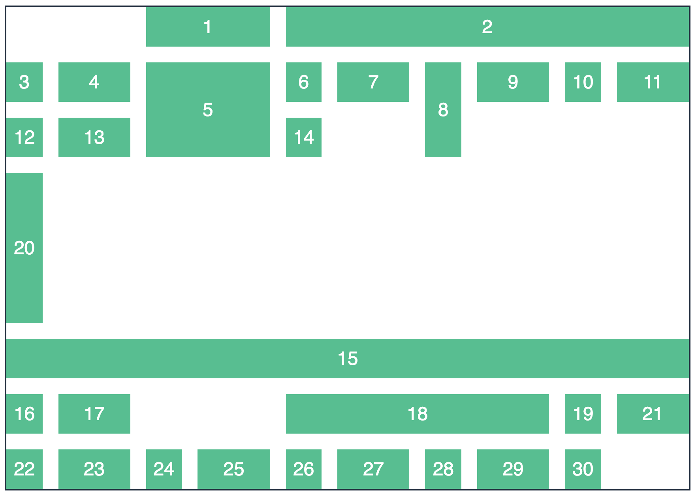
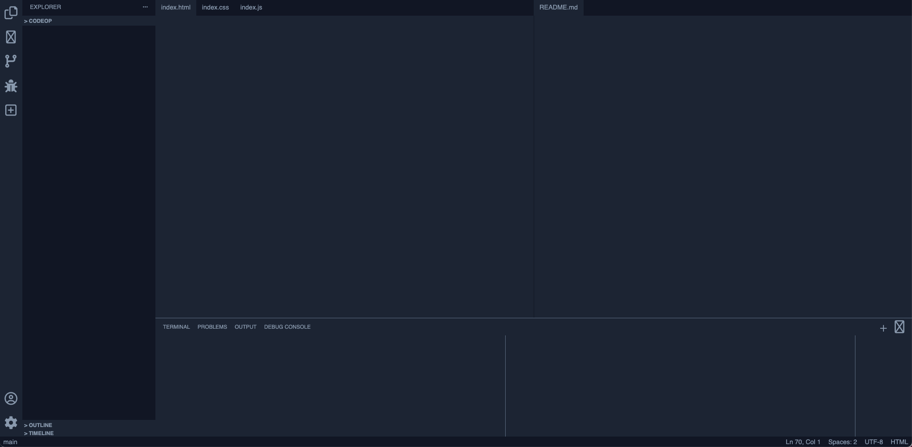

# CSS grid

En aquesta activitat practicaràs CSS grid i les seves propietats

## Objectius

- Entendre la sintaxi de CSS grid
- Treballar les maneres de posicionar elements amb CSS grid
- Aplicar CSS grid per a construir layouts senzills d'elements web habituals
- Utilitzar CSS grid per a construir layouts més complexes d'aplicacions web
- Combinar CSS grid amb Flexbox i entendre quin és més addient aplicar en cada cas
- Utilitzar les eines de desenvolupador del navegador per a treballar en CSS

## Exercicis

### _Warm up_

Practica CSS Grid amb el joc [Grid Garden](https://cssgridgarden.com/#ca)

### Exercici 1

- Obrir el fitxer `index.html`.

- Segueix les instruccions a `challenges.css` i afegeix el codi CSS necessari per a obtenir el següent resultat:

## Exercici 2

En aquest exercici, replicaràs l'aplicació del VS Code en HTML i CSS. Fes servir Grid tant com puguis. També pots utilitzar flexbox i tota la resta de propietats CSS que coneixes per tal de polir el resultat final.

### Part 1

Comença per dissenyar la maquetació general de l'aplicació. Si fas que cada etiqueta HTML tingui un contorn, et serà fàcil veure si allò que dibuixes és el que vols.

Utilitza les eines de desenvolupador de Chrome per a visualitzar els teus `grid`.

Intenta replicar aquest `layout`:

Pista: Donar noms a cadascuna de les àrees del `grid` és molt útil per a ubicar cada una de les cel·les.

### Part 2

Afegeix els detalls necessaris per fer-ho semblar el màxim possible al disseny de VS Code. Pots afegir icones, botons, textos...

Recorda que un `grid item` pot ser a la vegada un contenidor `grid`.

## Recursos

- [Grid Garden](https://cssgridgarden.com/#ca)
- [A complete guide to grid](https://css-tricks.com/snippets/css/complete-guide-grid/)
- [A simple visual cheatsheet for Grid](https://grid.malven.co/)
- [`auto-fill` vs `auto-fit`](https://css-tricks.com/auto-sizing-columns-css-grid-auto-fill-vs-auto-fit/)

## Notes

_Aquest és un projecte d'estudiant creat a [CodeOp](http://CodeOp.tech), al bootcamp de Front End Development a Barcelona._
