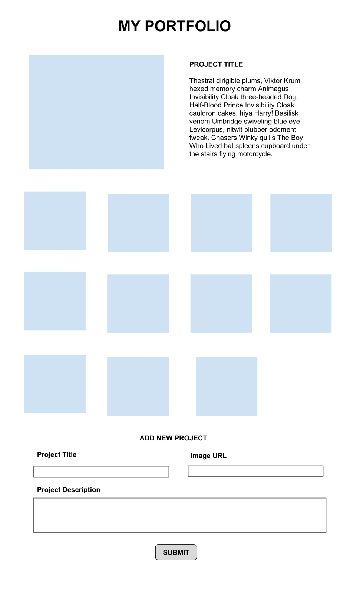

# Manipulació del DOM amb JavaScript pur (Plain JavaScript DOM Manipulations)

En aquest repositori crearàs un _portfolio_ modificant el _DOM_.

## Objectius

- Manipular el DOM directament, afegint i eliminant elements.
- Fer servir CSS per donar estils als elements de la pàgina.
- Afegir gestors d'esdeveniments (event handlers) per interactuar amb les accions que l'usuari faci a la pàgina.

## Configuració

- `npm install` per instal·lar Tailwind CSS.
- `npm start` per a inicialitzar el compilador de Tailwind CSS.
- Obre `index.html` al navegador amb el Live Server de VS Code.

## Requisits bàsics

_Nota: no feu servir jQuery ni cap altra llibreria en aquest exercici! L'objectiu de l'activitat és acostumar-se a fer "DOM manipulations" fent servir únicament JavaScript pur._

### 1. Crea un formulari (form) que afegeixi imatges a la pàgina.

- [ ] Afegeix funcionalitat.
  - El form ha d'acceptar una URL.
  - El form ha de tenir un botó "submit".
  - Després de prémer el botó, la nova imatge ha d'aparèixer a dalt de la pàgina.
- [ ] Afegeix estils.
  - Tot ha d'estar centrat.
  - Les imatges s'han d'emplaçar seguint una graella de 4 elements d'amplada. Pots aconseguir el resultat amb CSS pur o fent servir Bootstrap (si ja el coneixes).

### 2. Afegeix camps (fields) addicionals al form.

- [ ] Afegeix funcionalitat.
  - Crea un _input text box_ per al títol del projecte.
  - Afegeix un _text box_ més gran (busca `textarea`) per a la descripció del projecte.
  - Aquesta informació s'hauria d'emmagatzemar a algun lloc, però no la mostris encara. Pista: crea les variables que necessitis per emmagatzemar la informació del projecte: el títol, la descripció i la imatge.
- [ ] Afegeix estils.
  - Mira la imatge de sobre - el títol i la imatge són a la mateixa línia, i la descripció del projecte se situa a la línia de sota.

### 3. Crea la secció de _featured image_ (imatge destacada)

- [ ] Afegeix funcionalitat.
  - Si encara no hi ha imatges a la pàgina, no s'hauria de mostrar res.
  - Quan fem clic sobre les imatges s'hauria de mostrar/reemplaçar la imatge destacada amb les altres imatges.
- [ ] Afegeix estils.
  - La imatge destacada hauria d'aparèixer a l'esquerra i el títol i la descripció a la dreta.

### 4. Millora els estils

- [ ] Juga amb els estils per què sembli el més professional possible!

## Recursos

- [MDN - Manipulating the DOM Guide](https://developer.mozilla.org/en-US/docs/Learn/JavaScript/Client-side_web_APIs/Manipulating_documents)
- [Plain JS - Common DOM Manipulation methods](https://plainjs.com/javascript/manipulation/)
- [Eloquent JavaScript - The DOM](https://eloquentjavascript.net/14_dom.html)
- [Eloquent JavaScript - Handling Events](https://eloquentjavascript.net/15_event.html)

## Notes

_Aquest és un projecte d'estudiant creat a [CodeOp](http://CodeOp.tech), al bootcamp de Front End Development a Barcelona._
